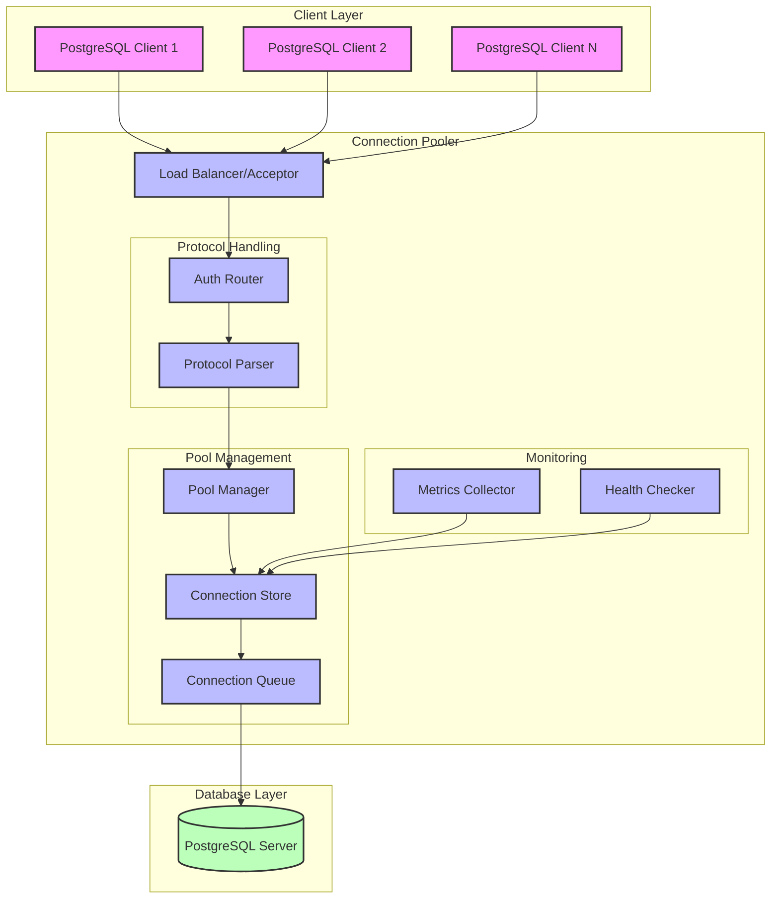

# RustBouncer

An educational PostgreSQL connection pooler implementation in Rust, inspired by PgBouncer.

## Overview

RustBouncer is a learning project that implements a simplified version of a PostgreSQL connection pooler. This project is designed to help understand how connection poolers work by implementing core concepts in Rust. While not intended for production use, it demonstrates key principles of database connection management, async programming in Rust, and network protocol handling.

### Educational Goals

- Understanding PostgreSQL wire protocol
- Learning async network programming in Rust
- Exploring connection pool design patterns
- Practicing systems programming concepts
- Implementing a subset of PgBouncer's features for learning purposes

### Comparison with PgBouncer

This is a simplified implementation that focuses on core concepts:

| Feature | RustBouncer | PgBouncer |
|---------|-------------|-----------|
| Connection Pooling | Basic | Advanced |
| Pool Modes | Session only | Session, Transaction, Statement |
| Authentication | Simple MD5 | Multiple methods |
| SSL Support | No | Yes |
| Admin Console | No | Yes |
| Production Ready | No | Yes |

## Getting Started

### Requirements

- Rust (latest stable)
- PostgreSQL (for testing)
- Basic understanding of:
  - PostgreSQL client/server protocol
  - Connection pooling concepts
  - Async programming in Rust

### Building from source

```bash
# Clone the repository
git clone https://github.com/krl4k/rustbouncer.git
cd rustbouncer

# Build the project
cargo build

# Run tests
cargo test
```

## Architecture Overview

This document outlines the simplified architecture of our learning implementation.

### System Components

1. **Connection Manager**
   - Maintains a basic pool of server connections
   - Handles connection lifecycle
   - Simple connection reuse strategy

2. **Client Handler**
   - Accepts client connections
   - Basic authentication
   - Routes client requests

3. **Protocol Parser**
   - Implements basic PostgreSQL wire protocol
   - Handles startup messages
   - Forwards queries

4. **Pool Orchestrator**
   - Simple pooling strategy
   - Basic health checks
   - Connection distribution

### System Flow



### Connection Lifecycle

1. **Client Connection**
   - TCP connection establishment
   - Simple authentication
   - Basic session parameters

2. **Query Processing**
   - Query receiving
   - Connection assignment
   - Result forwarding

3. **Connection Management**
   - Basic connection reuse
   - Simple health checking
   - Error handling

## Implementation Progress

Current status: **Educational Project**

### Learning Milestones

#### Phase 1: Basic Networking
- [x] TCP connection handling
- [x] Simple message passing
- [x] Basic PostgreSQL protocol implementation
- [x] Connection establishment flow

#### Phase 2: Core Pooling Logic
- [ ] Simple connection pool
- [ ] Basic client authentication
- [ ] Query forwarding
- [ ] Connection reuse

#### Phase 3: Advanced Features
- [ ] Transaction handling
- [ ] Simple monitoring
- [ ] Configuration system
- [ ] Configuration reloading
- [ ] Error handling patterns


## Learning Resources

### PostgreSQL Protocol
- [PostgreSQL Protocol Documentation](https://www.postgresql.org/docs/current/protocol.html)
- [Frontend/Backend Protocol](https://www.postgresql.org/docs/current/protocol-flow.html)

### Rust Async Programming
- [Asynchronous Programming in Rust](https://rust-lang.github.io/async-book/)
- [Tokio Documentation](https://tokio.rs/tokio/tutorial)

### Connection Pooling Concepts
- [PgBouncer Documentation](https://www.pgbouncer.org/usage.html)
- [Connection Pool Design Patterns](https://github.com/brettwooldridge/HikariCP/wiki/About-Pool-Sizing)


## Disclaimer

This is an educational project and is not intended for production use. For production environments, please use established solutions like PgBouncer.
