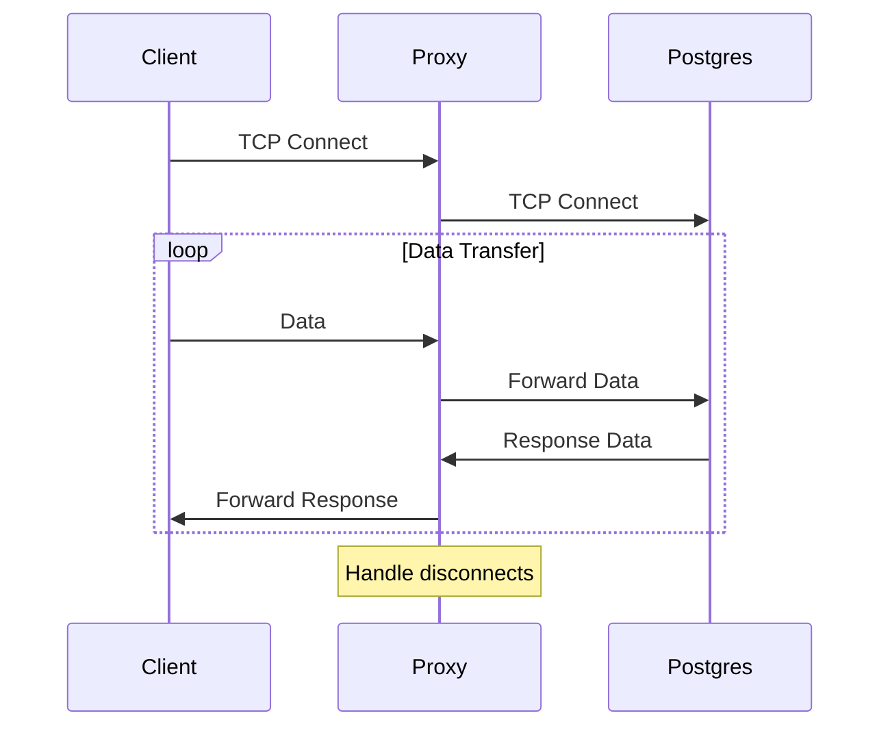

### Phase 0: Basic TCP Proxy (MVP)
Goal: Create a simple proxy that can accept connections and transfer data.

1. **Project Setup**
   - Basic connection pool
   - Basic configuration (host, port, max_connections)
   - Basic logging

2. **Simple TCP Proxy**
   - Accept TCP connections from clients
   - Create a connection to Postgres
   - Simple data transfer between them without parsing
   - Basic error handling (connection break)

