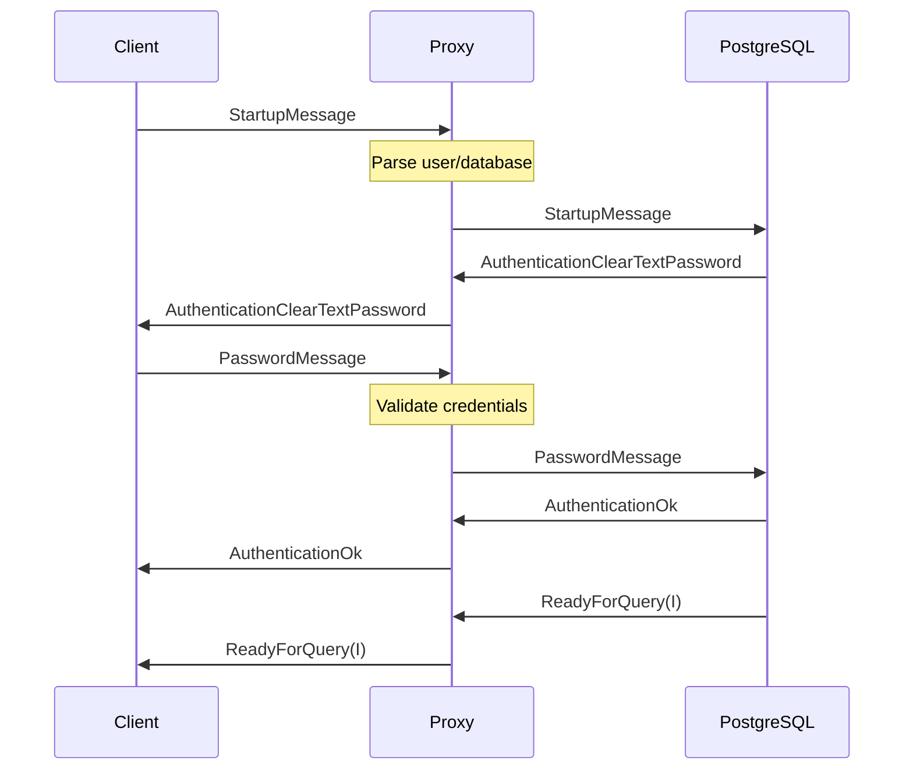
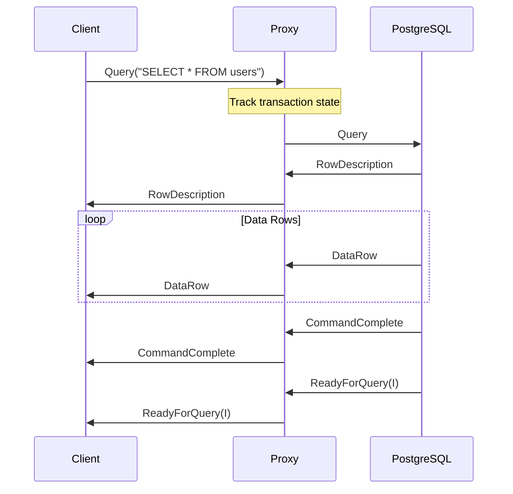

# Phase 1: PostgreSQL Protocol Implementation
## Overview & Goals

The goal of Phase 1 is to add protocol awareness to our basic TCP proxy, enabling intelligent connection management, security features, and monitoring capabilities.

### Why Protocol Parsing is Necessary

1. **Connection Management**
   - Identify transaction boundaries
   - Enable connection pooling
   - Handle prepared statements correctly
   - Manage session state

2. **Security & Control**
   - User authentication
   - Query monitoring
   - Resource limits enforcement
   - SQL injection protection

3. **Monitoring & Debugging**
   - Query timing
   - Error tracking
   - Performance metrics
   - Debug logging

## Message Structure

Every PostgreSQL message follows this basic format:
- 1 byte message type identifier
- 4 byte message length (including length itself)
- Message payload

### Essential Message Types

1. **Frontend Messages** (client → server)
   - Query: Simple text query execution
   - Terminate: Close connection
   - PasswordMessage: Authentication response

2. **Backend Messages** (server → client)
   - AuthenticationOk: Authentication successful
   - ReadyForQuery: Ready for new query
   - RowDescription: Describes result format
   - DataRow: Contains row data
   - CommandComplete: Query finished
   - ErrorResponse: Error information

## Protocol Flows

### Authentication Flow

### Query Execution Flow

## Session States

1. **Connection States**
   - Startup: Initial connection
   - Authentication: Verifying credentials
   - Ready: Ready for queries
   - Query: Processing query
   - Error: Error occurred
   - Terminated: Connection closed

2. **Transaction States**
   - Idle: No transaction active
   - Transaction: In transaction
   - Failed: Transaction failed

## Error Handling

### Types of Errors
1. **Protocol Errors**
   - Invalid message length
   - Invalid message type
   - Malformed messages
   - Invalid state transitions
   
2. **Authentication Errors**
   - Invalid credentials
   - Unauthorized database access
   - Connection limits exceeded

3. **I/O Errors**
   - Connection closed
   - Write failures
   - Read timeouts

### Error Response Components
- Severity (ERROR, FATAL, PANIC)
- SQLSTATE code
- Human-readable message
- Optional detail message
- Optional hint
- Error position in query

## Monitoring & Metrics

### Connection Metrics
- Active connections
- Total connections
- Failed authentications
- Connection duration
- Client information

### Query Metrics
- Queries processed
- Query duration
- Rows processed
- Error count

### Transaction Metrics
- Active transactions
- Committed transactions
- Rollback count
- Transaction duration

## Development Tasks

1. **Basic Protocol Support**
   - Message parsing implementation
   - Startup/authentication flow
   - Basic query flow
   - Error response handling

2. **State Management**
   - Session state tracking
   - Transaction monitoring
   - Connection termination
   - Connection pooling setup

3. **Monitoring Implementation**
   - Basic metrics collection
   - Logging system
   - Error tracking
   - Debugging tools

4. **Testing Strategy**
   - Message parsing tests
   - PostgreSQL integration tests
   - Load testing
   - Error handling verification

## Security Considerations

1. **Authentication**
   - Password encryption
   - SSL/TLS support
   - Authentication timeout
   - Failed attempt limits

2. **Access Control**
   - Database access restrictions
   - Query restrictions
   - Connection limits
   - IP filtering

3. **Resource Protection**
   - Query timeout
   - Memory limits
   - Connection limits
   - Rate limiting
